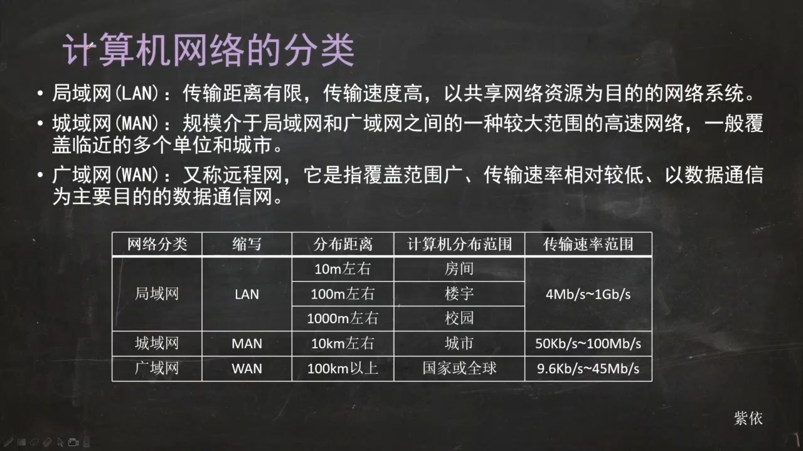
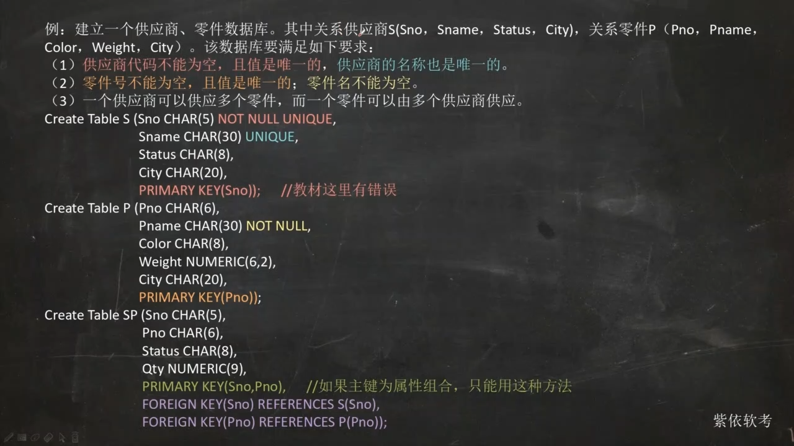

# 第一章

## CPU的组成

## 进制转换

​                      

# 第五章  计算机网络概述与网络硬件基础

主要考点

1. 计算机网络的分类（了解）
2. 网络拓扑结构（了解）
3. **网络互联设备**（重点）
4. 网络传输介质 

# 第八章

主要考点

1. SQL的基本组成
2. SQL的数据类型
3. 表的创建，修改和删除
4. 索引的创建和删除
5. 视图的创建和删除

# 第九章 非关系型数据库NoSQL

1. CAP理论和BASE特性
2. 各种NoSQL数据库的分类与特点

# 第十章